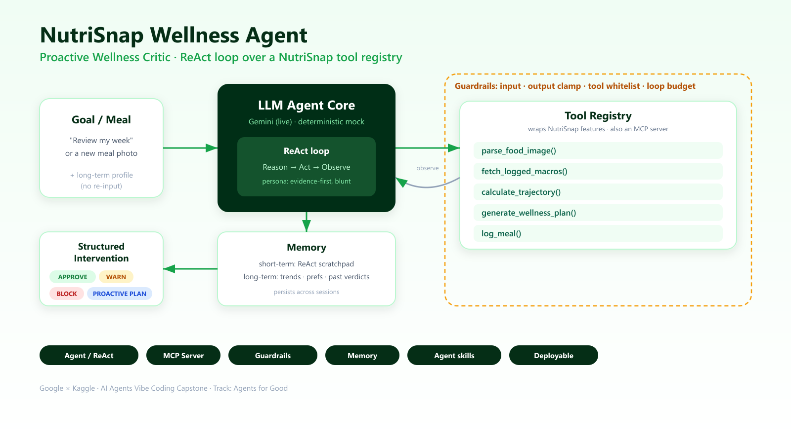

# NutriSnap

**Point your camera at a meal. Get calories, macros, and a full nutritional breakdown in seconds.**

Most calorie trackers ask you to search a database, guess a portion size, and log six
ingredients by hand. NutriSnap replaces that with one photo. AI vision identifies every
food item on the plate, estimates calories and protein/carbs/fat per item, and gives you
a reviewable breakdown before anything is logged.

**→ [Try it live](https://nutrisnap-mocha-psi.vercel.app)** — mobile-first, so open it on
your phone or use your browser's device view. No signup, no API key: tap a built-in
sample meal to see the full analysis immediately.

---

## What it does

**📸 Photo to macros.** Snap or upload a meal. Every item is identified separately with
its own calorie and macro estimate, plus totals, a health score, a confidence rating,
and a short nutrition tip.

**✏️ Review before you log.** Adjust servings, set the meal type, and correct the AI
before anything is committed. The model proposes; you decide.

**🎯 Daily dashboard.** Animated calorie ring, remaining-calorie counter, and macro
progress bars measured against your personal targets.

**📅 History & insights.** Every day grouped by date with per-day totals, a 7-day
calorie chart, average intake, and your macro distribution over time.

**🧮 Goal calculator.** Mifflin-St Jeor TDEE calculation to set personalized calorie and
macro targets for losing, maintaining, or gaining.

**🔥 Streaks and polish.** Considered empty, loading, and error states throughout.
Works offline — your data lives on your device.

---

## Autonomous Wellness Agent

Logging numbers is passive. NutriSnap also ships a **Proactive Wellness Critic** — an
autonomous agent that treats the app's own features as callable tools and acts on your
data without being asked.

It runs a **ReAct loop** (Reason → Act → Observe): it reads your eating history,
quantifies your trajectory, and then plans, approves, warns, or **blocks** a meal
outright — and generates a grocery list to close the nutritional gaps it finds.



**[Run it in the browser →](https://nutrisnap-mocha-psi.vercel.app/agent)** Seed a demo
week, run a weekly audit, or submit a meal and watch it reason in context.

The agent exists twice, deliberately: a reference Python implementation in
[`wellness-agent/`](wellness-agent), and a TypeScript port in
[`src/lib/agent.ts`](src/lib/agent.ts) so the deployed app can run it in the browser
against your real diary with no backend. The two are kept in lockstep.

| Component | Implementation |
| --- | --- |
| ReAct loop | [`agent_runtime.py`](wellness-agent/agent_runtime.py) — persona-driven Reason→Act→Observe |
| Tool registry | [`agent/tools.py`](wellness-agent/agent/tools.py) — 5 LLM-callable tools |
| MCP server | [`agent/mcp_server.py`](wellness-agent/agent/mcp_server.py) — same tools over Model Context Protocol |
| Guardrails | [`agent/guardrails.py`](wellness-agent/agent/guardrails.py) — input, output, and loop guards |
| Memory | [`agent/memory.py`](wellness-agent/agent/memory.py) — short-term scratchpad + long-term profile |

Reproducible verdicts from the demo suite: weekly audit → `PROACTIVE_PLAN` · burger
against a declining week → `BLOCK` · salad → `APPROVE` · non-food image → `BLOCK`
(guardrail catch).

```bash
cd wellness-agent

pip install -r requirements.txt   # optional: only for live Gemini + MCP
python demo_simulation.py         # narrated 4-scenario proof run
python agent_runtime.py "Review my week and optimize my shopping list"
python -m agent.mcp_server        # expose the tools as an MCP server
```

The demo backend is deterministic and needs no API key.

---

## Engineering notes

The interesting problem in NutriSnap isn't calling a vision model. It's making the
output trustworthy enough to build a product on.

**Typed output, not free text.** `POST /api/analyze` downscales the image client-side,
then calls Gemini with a strict `responseSchema`. The model doesn't return prose that
gets parsed — it fills a typed contract: per-item nutrition, totals, health score,
confidence, tip.

**Defensive normalization.** A raw model will happily return totals that don't match the
sum of its own items, or an occasional negative gram count. Every response goes through
a server-side reconciliation pass that rounds, clamps, and re-derives totals from items
before it reaches the client.

**Fallbacks over optimism.** Vision endpoints return transient `503 model overloaded`
under real traffic. Requests retry with exponential backoff across a multi-model
fallback chain rather than surfacing a failure to the user.

**Honest confidence.** The UI shows the model's confidence and always routes through a
review step. The product never pretends to a precision it doesn't have.

**Local-first persistence.** State is held in `localStorage` via `useSyncExternalStore`
— no account required, instant startup, works with no connection, and no user's food
diary sitting on someone else's server. The tradeoff is no cross-device sync; a Supabase
(Postgres + Auth + Storage) backend is the next architectural step, with local storage
remaining the offline cache layer.

---

## Tech stack

| Layer | Choice |
| --- | --- |
| Framework | Next.js (App Router) + React 19 |
| Language | TypeScript |
| Styling | Tailwind CSS v4 |
| AI | Google Gemini (`@google/genai`), `gemini-2.5-flash` with fallbacks |
| Icons / motion | lucide-react, framer-motion |
| Persistence | `localStorage` via `useSyncExternalStore` |
| Agent | Python (reference) + TypeScript port, MCP server |
| Hosting | Vercel |

---

## Running locally

```bash
npm install

# add your Gemini API key (https://aistudio.google.com/app/apikey)
echo "GEMINI_API_KEY=your_key_here" > .env.local

npm run dev   # http://localhost:3000
```

Open on your phone or use Chrome's device toolbar, then tap the center camera button.
No API key handy? The capture sheet has sample meals that analyze instantly.

```bash
npm run dev     # start dev server
npm run build   # production build
npm run lint    # eslint
```

The Python agent is a separate, self-contained project — see
[Autonomous Wellness Agent](#autonomous-wellness-agent) above.

### Project structure

```
src/app            Today / History / Insights / Settings, /agent, analyze API route
src/components     Capture flow, bottom nav, rings, cards, badges
src/lib            Gemini client, nutrition math, localStorage store, agent port
wellness-agent/    Python ReAct agent: runtime, tools, guardrails, memory, MCP server
public/samples     Sample meal photos
ai-logs/           Full build log: prompts, schema design, decisions
```

---

## Roadmap

- Supabase backend — Postgres, Auth, RLS, and Storage for meal photos, with cross-device sync
- Native iOS and Android builds via Capacitor
- Barcode scanning for packaged foods
- Weekly agent digests delivered by push notification

---

## Built with AI, documented in the open

NutriSnap was built with an AI pair-programmer, and the entire process is committed to
the repo. [`ai-logs/`](ai-logs) contains the real conversation trail — prompt iterations,
schema design decisions, and the debugging of the normalization and fallback layers.
[`CLAUDE.md`](CLAUDE.md) and [`AGENTS.md`](AGENTS.md) hold the working context that keeps
agent-assisted changes consistent with the architecture.

If you want to see how someone actually uses AI tooling to ship — not the marketing
version — start there.

---

MIT licensed. Issues and PRs welcome.
